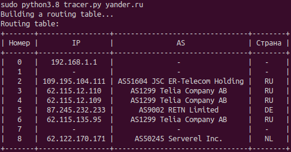

# as_tracer
Simple traceroute util.
The utility finds the path to the specified hostname and displays
IP, autonomous system (AS), ISP and country routers in a pretty table.
There are some parameters: `port` for listing traceroute socket and to send messages,
`timeout` for receiving datagrams from route nodes, `retries` to ask route nodes and `maximum nodes` in route.
 
### The requirements must be set before use:
* python ~=3.8
```
python3 -m pip install -r requirements.txt
```

**_You can run the utility with the -h flag to see how the parameters are passed:_**
```
python3 tracer.py -h
```

### Usage example:
```
python3 tracer.py yander.ru
```


