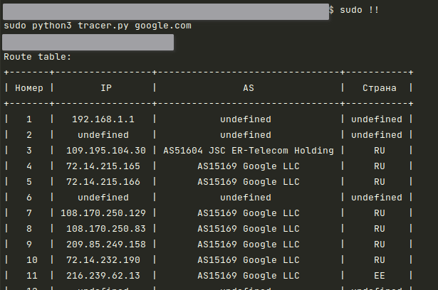

# tracer
Трассировка автономных систем.
Traceroute на минималках.

### Usage:
```
python3 tracer.py google.com
```

### Пример запуска:



#### Полное описание можно посмотреть так -
```
python3 tracer.py --help
```

# Подготовка к запуску
Возможно, перед запуском надо написать -
```
python3 -m pip install -r requirements.txt
```

по дефолту должно хватить -
```
pip3 install pydantic
```
